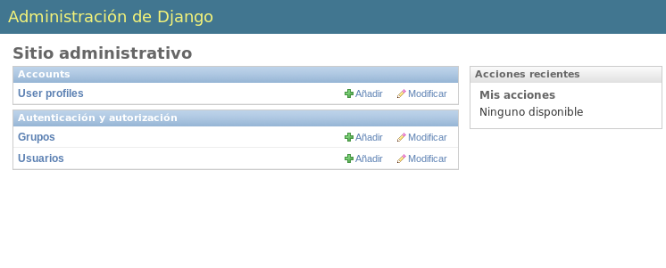
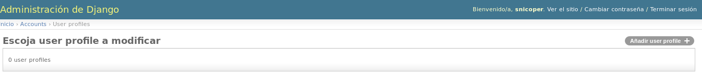
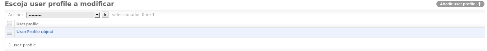
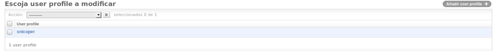
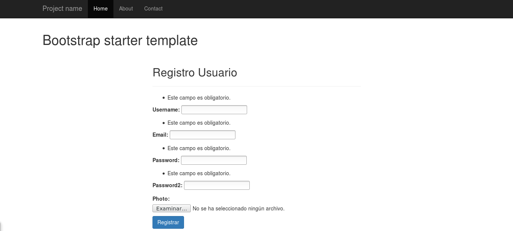

.. _reference-registro_usuarios:

Creación de registros de usuarios
=================================

Una de las primeras cosas que se suele hacer, es el manejo de usuarios, como el registro, login, logout, etc.

Django tiene un sistema de usuarios, recuerda que nosotros ya tenemos un usuario registrado y ademas es administrador del sitio, es decir que también maneja permisos ademas de sesiones.

Vamos a crear una manera para registrar usuarios en el sitio, primero vamos a crear una **app accounts** donde muestre el formulario para registrar usuario. Un modelo para extender los datos del usuario, donde el usuario podrá añadir una imagen/avatar, dentro de esta **app**, añadiremos la manera para que el usuario pueda hacer **login y logout**.

Django, como he comentado, incorpora un sistema de manejo de usuarios, si vemos en la base de datos las tablas que creó cuando usamos la primera vez el comando ``./manage.py migrate``, vemos que creó las tablas ``auth_*`` y otra para las sesiones, ``django_session``. Si nos fijamos en la tabla ``auth_user`` vemos las columnas ``id, password, is_superuser, username, etc``, eso significa que Django tiene un modelo que hace de 'puente' entre Django y la base de datos.

Vamos a crear nuestro primer modelo que tenga una relación **One to One** donde una campo del modelo que crearemos sera una relación con el modelo ``User`` en la base de datos, la tabla es ``auth_user``.

En primer lugar, vamos a crear la **app accounts**

.. code-block:: bash

    ./manage.py startapp accounts

Ahora, en ``tutorial_django/settings.py`` al final del archivo añadimos

.. code-block:: python

    # tutorial_django/settings.py
    LOGIN_URL = '/accounts/login/'
    LOGOUT_URL = '/accounts/logout/'

``LOGIN_URL`` y ``LOGOUT_URL``, los pongo para mostrarlos, pero usa los mismos valores que tienen por defecto, cuando una pagina requiera que el usuario este logueado (por medio de decoradores en las vistas, por ejemplo), lo redireccionara automáticamente a ``LOGIN_URL`` y cuando un usuario haga logout lo redireccionara al valor de ``LOGOUT_URL``

El siguiente paso es decirle a Django que hemos creado una **app**, en el mismo archivo ``tutorial_django/settings.py``, en ``INSTALLED_APPS`` añadimos ``accounts``

.. code-block:: python

    # tutorial_django/settings.py

    INSTALLED_APPS = (
        'django.contrib.admin',
        'django.contrib.auth',
        'django.contrib.contenttypes',
        'django.contrib.sessions',
        'django.contrib.messages',
        'django.contrib.staticfiles',

        'home',
        'accounts',
    )

Ahora, vamos a crear nuestro modelo, para ello, editamos ``accounts/models.py`` con el siguiente código

.. code-block:: python

    # accounts.models.py

    from django.db import models
    from django.conf import settings

    class UserProfile(models.Model):

        user = models.OneToOneField(settings.AUTH_USER_MODEL)
        photo = models.ImageField(upload_to='profiles', blank=True, null=True)

Cada modelo es una subclase de ``django.db.models.Model`` y cada atributo de la clase ``UserProfile`` representa una columna en la base de datos.

Cuando hagamos una **migración** (ahora, dentro de un rato), veremos que los nombres de tablas en la base de datos, por defecto las crea de la siguiente manera, nombreapp_nombremodelo, convierte todo a minusculas y pone un guion bajo ``_`` entre el nombre de la **app** y el nombre del modelo, es decir, cuando cree la tabla en la base de datos nuestro modelo ``UserProfile``, creara una tabla con el nombre ``accounts_userprofile``.

Cada propiedad en el modelo ``UserProfile``, es una clase en el modulo ``models`` y aquí tienes una `lista <https://docs.djangoproject.com/en/1.8/ref/models/fields/#field-types>`_ con todos los campos y opciones en los argumentos de cada campo.

Otra cosa a comentar, es la linea ``from django.conf import settings``, también podíamos a ver puesto ``from django.contrib.auth import User``, pero tal y como lo hemos puesto, nos aseguramos que siempre leemos el modelo ``User`` que estamos usando, ya que todo esto lo podemos personalizar y crear nuestros propios modelos ``User``, por defecto `settings.AUTH_USER_MODEL <https://docs.djangoproject.com/en/1.8/ref/settings/#auth>`_ es `auth.User`.

Antes de continuar, tenemos que instalar un paquete Python `Pillow <https://github.com/python-pillow/Pillow>`_ para manejar imágenes.

.. code-block:: bash

    # Dentro del entorno virtual (tutorial_django)
    pip install Pillow

Ahora vamos a crear nuestra primera migración de una **app** creada, para ello, en la terminal usamos el comando ``makemigrations nombre_app``

.. code-block:: bash

    ./manage.py makemigrations accounts

De momento, si vemos en el explorador de archivos, dentro de ``src/accounts/migrations`` se ha creado un archivo ``0001_initial.py`` y si lo abrimos, podemos ver que creara tres campos, ``id``, que lo crea de manera implícita (todos lo modelos crea un campo ``id`` de manera implícita a no ser que se diga de manera explicita), ``photo`` y ``user``.

Pero si vemos en la base de datos, aun no ha creado nada y antes de que lo cree, vamos a usar el comando ``sqlmigrate nombre_app nombre_migracion``. En este caso, el nombre_app es ``accounts`` y el nombre_migracion ``0001_initial`` (omitimos el ``.py``)(con solo la numeración es suficiente, en este caso ``0001``), de esta manera podemos ver la sentencia **SQL** que ejecutara cuando usemos el comando ``migrate``.

.. code-block:: bash

    ./manage.py sqlmigrate accounts 0001_initial
    BEGIN;
    CREATE TABLE "accounts_userprofile" (
        "id" integer NOT NULL PRIMARY KEY AUTOINCREMENT,
        "photo" varchar(100) NULL,
        "user_id" integer NOT NULL UNIQUE REFERENCES "auth_user" ("id")
    );

.. note::

    La sentencia SQL puede variar según el **RDBMS** elegido. La mostrada es la que usara con **SQLite**.

Si nos parece bien lo que va hacer, ejecutamos ``migrate`` y ya si que los cambios se reflejaran en la base de datos.

.. code-block:: bash

    ./manage.py migrate

Vamos a ir a la administración de Django `http://127.0.0.1:8000/admin/ <http://127.0.0.1:8000/admin/>`_ y podemos observar que no hay nada diferente!, ¿donde configuramos los nuevos perfiles de los usuarios? :), hay que decirle a la administración Django, que nos muestre el modelo recién creado.

Cuando creamos las **apps**, un archivo que nos crea en la estructura es ``admin.py``, vamos a editarlo y poner lo siguiente.

.. code-block:: python

    # accounts/admin.py

    from django.contrib import admin

    from .models import UserProfile

    admin.site.register(UserProfile)

Y ahora si nos sale el modelo ``User Profile``

y si pinchamos, podemos ver que no sale ningún campo

Si pinchamos en **Añadir user profile**, podemos añadir datos a usuarios, por que como se puede ver, el campo **User:**, nos muestra los usuarios que tenemos registrados, en nuestro caso, solo uno y podemos incluir una imagen o no, ya que el campo, cuando lo creemos como parámetros, pusimos ``blank=True, null=True``, ``blank`` es para los formularios, con ``True`` decimos que permitimos que los campos podrán estar vacíos y con ``null`` es para las base de datos, con ``True`` decimos el el campo permite datos nulos (por defecto, ambos campos son ``False``).

También, podemos observar algo no deseado, si vamos al gestor de archivos, podemos ver que nos ha creado un directorio **profiles** en la raíz del proyecto, lo ideal es contener los archivos **media**, dentro de un directorio, para configurar donde almacenar los archivos **media**, vamos al archivo de configuración ``tutorial_django/settings.py`` y al final del archivo añadimos:

.. code-block:: python

    # tutorial_django/settings.py

    MEDIA_ROOT = os.path.join(BASE_DIR, 'media')
    MEDIA_URL = '/media/'

Donde ``MEDIA_ROOT`` indica la ruta física del directorio (en este caso ``/path/directorio/proyecto/src/media``, que lo genera dinamicamente con ``os.path.join()``) y ``MEDIA_URL`` es lo mismo que ``STATIC_URL``, en las plantillas, antepondrá en la **URI** el valor, en este caso también ``/media/``.

Ahora vamos a crear el directorio **media** en la raíz del proyecto y a mover **profiles** dentro de **media**.

.. code-block:: bash

    mkdir media
    mv profiles/ media/

Ahora, si cambias la imagen, veras que la nueva imagen la sube a ``src/media/profiles``.

Si nos fijamos en la administración, podemos ver que ahora tenemos una entrada

Pero, el nombre que muestra ``UserProfile object`` no es muy intuitivo, ahora solo hay uno, pero si hubiesen 100, a ver como averiguamos que elemento pertenece a **X** usuario...

Vamos a solucionar esto, vamos a editar el modelo ``accounts/models.py`` y añadimos el siguiente método

.. code-block:: python

    # accounts/models.py

    class UserProfile(models.Model):

        # ...

        def __str__(self):
            return self.user.username

Aquí podemos observar, primero, lo fácil que es acceder los campos de las columnas relacionales, en este caso, obtenemos el campo ``username`` de la clase ``django.contrib.auth.models.User`` que tenga relación con el objeto actual ``UserProfile``, esto es gracias al **ORM** que incorpora Django y en segundo lugar, si actualizamos la pagina de administración, ahora observamos que nos muestra el **username** al que pertenece la fila de ``UserProfile``

Con ``__str__`` obtenemos **'algo'** y no el objeto en si, que era lo que antes nos mostraba. (Se puede pensar en ``__str__`` como ``toString`` en otros lenguajes)

Siguiente paso, crear formularios **.py** para la representación **.html**, creamos un archivo ``forms.py`` dentro de la **app accounts** y le añadimos el siguiente código:

.. code-block:: python

    # accounts/forms.py

    from django import forms
    from django.contrib.auth.models import User

    class RegistroUserForm(forms.Form):

        username = forms.CharField(min_length=5)
        email = forms.EmailField()
        password = forms.CharField(min_length=5, widget=forms.PasswordInput())
        password2 = forms.CharField(widget=forms.PasswordInput())
        photo = forms.ImageField(required=False)

        def clean_username(self):
            """Comprueba que no exista un username igual en la db"""
            username = self.cleaned_data['username']
            if User.objects.filter(username=username):
                raise forms.ValidationError('Nombre de usuario ya registrado.')
            return username

        def clean_email(self):
            """Comprueba que no exista un email igual en la db"""
            email = self.cleaned_data['email']
            if User.objects.filter(email=email):
                raise forms.ValidationError('Ya existe un email igual en la db.')
            return email

        def clean_password2(self):
            """Comprueba que password y password2 sean iguales."""
            password = self.cleaned_data['password']
            password2 = self.cleaned_data['password2']
            if password != password2:
                raise forms.ValidationError('Las contraseñas no coinciden.')
            return password2

Los formularios son muy parecidos a los modelos, pero en vez de usar un objeto **model** usa **forms**.

Puedes ver `aquí <https://docs.djangoproject.com/en/1.8/ref/forms/fields/>`_ la lista completa de **campos** y **widgets** para los formularios.

A groso modo, podemos ver que ``username`` requiere de al menos 5 caracteres y es un campo tipo **text**, ``email`` es un campo tipo **email**, ``password`` y ``password2`` son campos tipo **password** y requiere de al menos 5 caracteres y ``photo`` es un campo tipo **file** que ademas sera tratado como un archivo de imagen (comprobara que sea un tipo de imagen).

Con ``clean_nombre_campo``, donde **nombre_campo** es un campo de propiedad, lo que hace, es una validación personalizada cuando el usuario le da al botón del formulario, en este caso, comprueba que ``password`` y ``password2`` sean iguales (por eso ``password2`` no le puse ``min_length=5``, por que aquí han de ser iguales y si ``password`` no cumple con los requisitos, lanzara un ``forms.ValidationError``).

Se puede ver que ``clean_username`` y ``clean_email`` comprueba si existe un **username** o **email** en la base de datos, si existe lanzara un ``forms.ValidationError()``.

Ahora, nos queda ver como implementar esto para que lo muestre en un archivo **html**, primero vamos a crear la vista para el registro (de momento, simplificada).

.. code-block:: python

    # accounts/views.py

    from django.shortcuts import render

    from .forms import RegistroUserForm

    def registro_usuario_view(request):
        if request.method == 'POST':
            form = RegistroUserForm(request.POST, request.FILES)
        else:
            form = RegistroUserForm()
        context = {
            'form': form
        }
        return render(request, 'accounts/registro.html', context)

Lo que hacemos es importar el formulario que acabamos de crear ``RegistroUserForm``, después creamos la vista para manejar los datos y dentro de la vista esto es lo que hace.

Comprueba si ``method`` de la solicitud (**request**), es **POST**, es decir, si le a dado al botón del formulario, en caso de afirmativo, crea una instancia de ``RegistroUserForm`` y lo rellena con los datos ``request.POST, request.FILES``, que son los datos del formulario (si no tuviera un tipo file, no haría falta ``request.FILES``), en caso contrario, es decir la primera carga de la pagina que el ``method`` seria **GET**, simplemente instanciaria ``RegistroUserForm`` sin datos.

Por ultimo almacenos el formulario en el contexto y renderizamos la pagina, devolviendo la respuesta, el ruta/nombre plantilla y el contexto.

Es necesario crear una ``url()`` en el archivo **URLconf**, primero, vamos a ``tutorial_django/urls.py`` y añadimos la siguiente **url** dentro de la lista ``urlpatterns``:

.. code-block:: python

    # tutorial_django/urls.py

    urlpatterns = [
        # ...
        url(r'^accounts/', include('accounts.urls')),
    ]

Creamos el archivo ``accounts/urls.py`` y añadimos lo siguiente

.. code-block:: python

    # accounts/urls.py

    from django.conf.urls import url

    from . import views

    urlpatterns = [
        url(r'^registro/$', views.registro_usuario_view, name='accounts.registro'),
    ]

Ya como paso final, creamos el directorio ``accounts/templates/accounts`` y dentro creamos el archivo **html** ``registro.html`` con el siguiente contenido:

.. code-block:: html

    # accounts/templates/accounts/registro.html

    

    Registro de usuario

    
        

            

                

                    <h2>Registro Usuario</h2>
                

                <form method="post" action="" enctype="multipart/form-data">
                    
                    {{ form.as_p }}
                    <button type="submit" class="btn btn-primary">Registrar</button>
                </form>
            

        

    

Una vez mas extendemos la plantilla usando ``base.html``, le damos un ``<title></title>`` dentro del bloque ``Registro de usuario`` y le añadimos el contenido dentro del bloque ````.

.. note::

    ```` se puede escribir ```` pero a mi personalmente me gusta añadir en el **endblock** el nombre al que pertenece el bloque, por claridad.

En cuanto al formulario hay una **tag** nueva ```` (`wikipedia <http://es.wikipedia.org/wiki/Cross_Site_Request_Forgery>`_ y `documentacion Django <https://docs.djangoproject.com/en/1.8/ref/csrf/>`_ lectura obligatoria) la etiqueta es obligatoria por defecto en formularios con ``method="post"``.

``{{ form.as_p }}`` ``form`` es la variable de contexto que pasamos desde la vista (un objeto ``RegistroUserForm``, que a su vez es subclase de ``django.forms.Form``), muestra una representación en **html** de los campos. Al usar ``as_p``, rodea los elementos del formulario en etiquetas ``
``.

A parte de ``form.as_p`` hay dos opciones mas ``form.as_table`` y ``form.as_ul``, todos hacen los mismo, lo único a tener en cuanta es que ``as_ul`` y ``as_table`` insertan las propiedades del **form** en ``<tr><td>label</td><input></tr>`` es decir, omite ``<table>`` y ``</table>`` (``as_ul`` omite ``<ul>`` y ``</ul>``), por otro lado, también saber que ``{{ form.as_X }}`` no añade las etiquetas **html** ``<form></form>`` ni lo botones.

Si vamos al navegador con la url `http://127.0.0.1:8000/accounts/registro/ <http://127.0.0.1:8000/accounts/registro/>`_ podemos ver el siguiente resultado:

Realmente sencillo, ahora se puede añadir o quitar campos de una manera muy sencilla o usar este formulario en otras vistas/plantillas sin cambiar nada.

Vamos a poner un poco de estilo con los **widgets**, volvemos al archivo ``accounts/forms.py`` y añadimos los **widgets**.

.. code-block:: python

    # accounts/forms.py

    # ...

    username = forms.CharField(
        min_length=5,
        widget=forms.TextInput(attrs={'class': 'form-control'}))

    email = forms.EmailField(
        widget=forms.EmailInput(attrs={'class': 'form-control'}))

    password = forms.CharField(
        min_length=5,
        widget=forms.PasswordInput(attrs={'class': 'form-control'}))

    password2 = forms.CharField(
        min_length=5,
        widget=forms.PasswordInput(attrs={'class': 'form-control'}))

    photo = forms.ImageField(required=False)

    # ...

Para ver y comprender en mas profundidad los formularios, te recomiendo visitar las `documentacion <https://docs.djangoproject.com/en/1.8/#forms>`_ de Django.

Ahora falta '¿Que hacer cuando se han validado los datos?', para ello abrimos el archivo ``accounts/views.py`` y lo re escribimos de la siguiente manera.

.. code-block:: python

    # accounts/views.py

    from django.shortcuts import render
    from django.contrib.auth.models import User
    from django.shortcuts import redirect
    from django.core.urlresolvers import reverse

    from .forms import RegistroUserForm
    from .models import UserProfile

    def registro_usuario_view(request):
        if request.method == 'POST':
            # Si el method es post, obtenemos los datos del formulario
            form = RegistroUserForm(request.POST, request.FILES)

            # Comprobamos si el formulario es valido
            if form.is_valid():
                # En caso de ser valido, obtenemos los datos del formulario.
                # form.cleaned_data obtiene los datos limpios y los pone en un
                # diccionario con pares clave/valor, donde clave es el nombre del campo
                # del formulario y el valor es el valor si existe.
                cleaned_data = form.cleaned_data
                username = cleaned_data.get('username')
                password = cleaned_data.get('password')
                email = cleaned_data.get('email')
                photo = cleaned_data.get('photo')
                # E instanciamos un objeto User, con el username y password
                user_model = User.objects.create_user(username=username, password=password)
                # Añadimos el email
                user_model.email = email
                # Y guardamos el objeto, esto guardara los datos en la db.
                user_model.save()
                # Ahora, creamos un objeto UserProfile, aunque no haya incluido
                # una imagen, ya quedara la referencia creada en la db.
                user_profile = UserProfile()
                # Al campo user le asignamos el objeto user_model
                user_profile.user = user_model
                # y le asignamos la photo (el campo, permite datos null)
                user_profile.photo = photo
                # Por ultimo, guardamos tambien el objeto UserProfile
                user_profile.save()
                # Ahora, redireccionamos a la pagina accounts/gracias.html
                # Pero lo hacemos con un redirect.
                return redirect(reverse('accounts.gracias', kwargs={'username': username}))
        else:
            # Si el mthod es GET, instanciamos un objeto RegistroUserForm vacio
            form = RegistroUserForm()
        # Creamos el contexto
        context = {'form': form}
        # Y mostramos los datos
        return render(request, 'accounts/registro.html', context)

    def gracias_view(request, username):
        return render(request, 'accounts/gracias.html', {'username': username})

El código ya esta comentado, pero me gustaría comentar el redireccionamiento que se ha hecho cuando el formulario ha sido valido.

Las partes de código importantes son las siguiente:

.. code-block: python

    from django.shortcuts import redirect
    from django.core.urlresolvers import reverse

Importar los módulos a usar, mientras ``redirect`` redirecciona a otra pagina (como si lo escribiera en la barra de navegación del explorador), ``reverse`` obtiene a que **URI** rediseccionar, el primer parámetro de ``reverse`` es el ``name=''`` que se pone en los **URLconf** y los ``kwargs`` son los parámetros dinámicos que espera en el patrón de ``url()``.

.. code-block:: python

    # accounts/urls.py

    url(
        r'gracias/(?P<username>[\w]+)/$',
        views.gracias_view,
        name='accounts.gracias'
    ),

Esta es la **url** que se ha añadido al **URLconf** y se pude ver ``(?P<username>[\w]+)`` que es una simple expresión regular, donde ``<username>`` es la variable que pasara a la vista con el valor ``[\w]+``.

Ahora queda la plantilla ``accounts/templates/accounts/gracias.html`` con el siguiente código

.. code-block:: html

    # accounts/templates/accounts/gracias.html

    

    Gracias por registrarte

    
        <h2>{{ username }} gracias por registrarte!</h2>
    

Ya tenemos un registro básico en la base de datos, podemos ir a la administración y ver que se han creado 2 filas, una en la tabla **Usuarios** y otra en **User profiles**.

Esto ha sido una manera de hacer un registro de usuario con un profile, hay varias maneras de hacer las cosas e incluso paquetes de terceros, el objetivo era ver los formularios con ``forms.Form``, pero también es posible crear formularios obteniendo los datos de los modelos '``forms.ModelForm``' que veremos mas adelante. También hemos visto como podemos validar los datos de los campos y lanzar errores ``forms.ValidationError()``.

En la siguiente sección veremos como hacer **login y logout** :)
