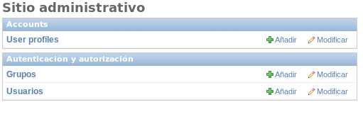
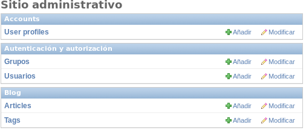
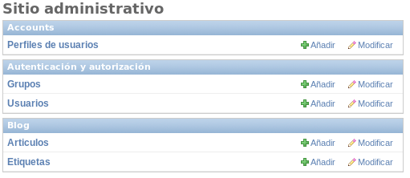
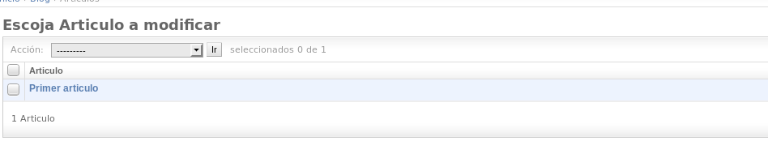
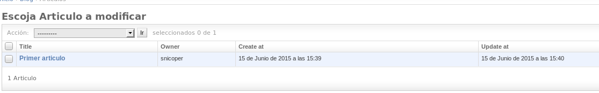
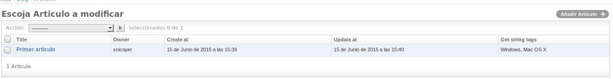
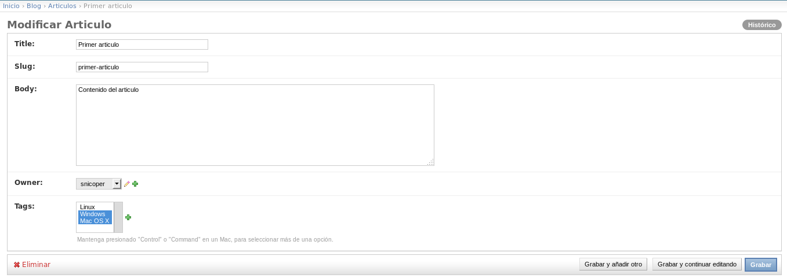
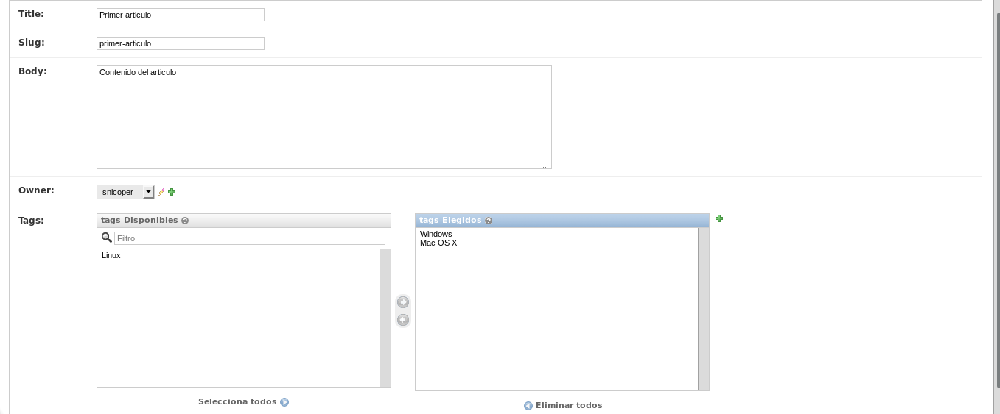

.. _reference-blog-administracion:

Administración
==============

La administración de Django es un añadido espectacular, genera dinamicamente un sistema **CRUD** que nos ahorra cientos de horas, que incluso usando otros lenguajes como PHP o ASP.NET MVC 6 (vnext), yo al menos incluiría el sistema al menos para la parte del desarrollo por lo cómodo que es.

Lo vimos con :ref:`reference-accounts-index`, donde mostrábamos como podíamos editar, añadir o ver los perfiles de usuario.

Para empezar vamos a hacer lo mismo, en primer lugar arrancamos el servidor ``./manage.py runserver`` y vamos a ir a la administración `http://127.0.0.1:8000/admin/ <http://127.0.0.1:8000/admin/>`_

Se observa (y ahora, se esperaba) que no muestra los modelos creados en el blog, para ello, como con **accounts**, editamos el archivo ``blog/admin.py`` para incluir los modelos a la administración.

.. code-block:: python

    # blog/admin.py

    from django.contrib import admin

    from .models import Article, Tag

    admin.site.register(Article)
    admin.site.register(Tag)

Ahora si actualizamos veremos que muestra ambos modelos (también, algo que ya esperábamos).

Lo primero que vamos hacer es cambiar los nombres que muestra de los modelos, por defecto (usa reglas del ingles), añade **s** o **es** al final del nombre del modelo, **Article** lo cambia a **Articles** y **Country** lo cambiaría a **Countries** y no siempre es lo que desearíamos, a parte, si vemos en **User profiles** que pertenece al modelo ``UserProfile``, se intuye que parte las palabras en las letras mayúsculas y lo convierte en minúsculas excepto el primer carácter.

Para cambiar este comportamiento por defecto, vamos a crear unas clases dentro de las clases del modelo llamada ``Meta`` y dentro, añadiremos meta información.

Primero cambiamos el modelo ``UserProfile``

.. code-block:: python

    # accounts/models.py

    class UserProfile(models.Model):

        user = models.OneToOneField(settings.AUTH_USER_MODEL)
        photo = models.ImageField(upload_to='profiles', blank=True, null=True)

        class Meta:
            verbose_name = 'Perfil de usuario'
            verbose_name_plural = 'Perfiles de usuarios'

        # ...

Y ahora, el modelo del blog

.. code-block:: python

    # blog/models.py

    class Tag(models.Model):

        # ...

        class Meta:
            verbose_name = 'Etiqueta'
            verbose_name_plural = 'Etiquetas'

        # ...

    class Article(models.Model):

        # ...

        class Meta:
                verbose_name = 'Articulo'
                verbose_name_plural = 'Articulos'

        # ...

Realmente fácil como cambiar el nombre que mostrara los modelos.

Ahora si pinchamos en `Articulos <http://127.0.0.1:8000/admin/blog/article/>`_ vemos que nos muestra un elemento

Siendo sinceros, no es mucha información, para ver quien lo creo y cuando, abría que pinchar para editarlo y ver la información (que las fechas ni las podríamos ver en un principio).

.. note::

    Las fechas en los modelos en los campos pasamos los argumentos ``auto_now=True`` y ``auto_now_add=True`` (se añadirán o modificaran automáticamente) por lo que en la administración no muestra los campos. Si queremos modificarlos a mano, en los campos del modelo, deberemos añadir el argumento ``editable=True`` de esta manera ``create_at = models.DateTimeField(auto_now_add=True, editable=True)``

    De igual manera, los **slugs** podríamos hacer que no muestre el campo en la administración (recuerda que se generan automáticamente antes de guardar el objeto) de esta manera ``slug = models.SlugField(max_length=100, editable=False)``

Vamos a modificar el comportamiento, para que nos muestre los campos que consideremos que nos de una información útil.

.. code-block:: python

    # blog/admin.py

    class ArticleAdmin(admin.ModelAdmin):

        list_display = ('title', 'owner', 'create_at', 'update_at')

    admin.site.register(Article, ArticleAdmin)

Hemos creado una clase ``ArticleAdmin`` que es subclase de ``django.contrib.admin.ModelAdmin``, hemos añadido una propiedad ``list_display`` con una tupla (podría ser una lista), con las propiedades del modelo ``Article`` que queremos mostrar.

Después añadimos (registramos) ``ArticleAdmin`` en ``admin.site.register(Article, ArticleAdmin)`` donde el primer argumento es el modelo, y el segundo la subclase de ``ModelAdmin`` y el resultado podemos ver en la siguiente captura.

Podemos crear nuestros propios métodos en el modelo para mostrar información. Por ejemplo, vamos a obtener un **string** con las etiquetas con las **Tags**, que tiene el articulo.

.. code-block:: python

    # blog/models.py

    # Añadimos el metodo en la clase(modelo) Article
    def get_string_tags(self):
        return ', '.join([tag.name for tag in self.tags.all()])

.. code-block:: python

    # blog/admin.py

    # Modificamos el list_display
    list_display = ('title', 'owner', 'create_at', 'update_at', 'get_string_tags')

Simplemente añadiendo como **string** ``get_string_tags`` (no podemos añadir un método que acepte parámetros), obtenemos la devolución del método (debe devolver valores simples, **strings, fechas, int**, etc). Se puede ver el resultado en la siguiente captura.

Ahora, si pinchamos dentro de `Primer articulo <http://127.0.0.1:8000/admin/blog/article/1/>`_ podemos ver lo siguiente.

Vamos solo a cambiar una cosa aquí (aunque se podrían hacer muchas cosas), si nos fijamos en **Tags:**, muestra las 2 **tags** que tiene el articulo.

Vamos a cambiar la forma en que muestra las etiquetas, para que seas mas fáciles de seleccionar, usando la propiedad ``filter_horizontal``, añadimos en una tupla o lista, las propiedades del modelo ``ManyToManyField`` que queremos que muestre dos cajas los elementos.

.. code-block:: python

    # blog/admin.py

    class ArticleAdmin(admin.ModelAdmin):

        list_display = ('title', 'owner', 'create_at', 'update_at', 'get_string_tags')
        filter_horizontal = ('tags',)

Y el resultado:

Esta sección la damos por terminada, aunque esto es solo la punta del iceberg, te recomiendo la `documentación <https://docs.djangoproject.com/en/1.8/ref/contrib/admin/>`_ para una lista completa de lo que se puede hacer en la administración.

En las siguientes secciones, vamos a generar un sistema **CRUD** (aunque teniendo la administración, no es necesario, pero para demostrar lo fácil que es crear, editar y eliminar elementos, lo haremos)
