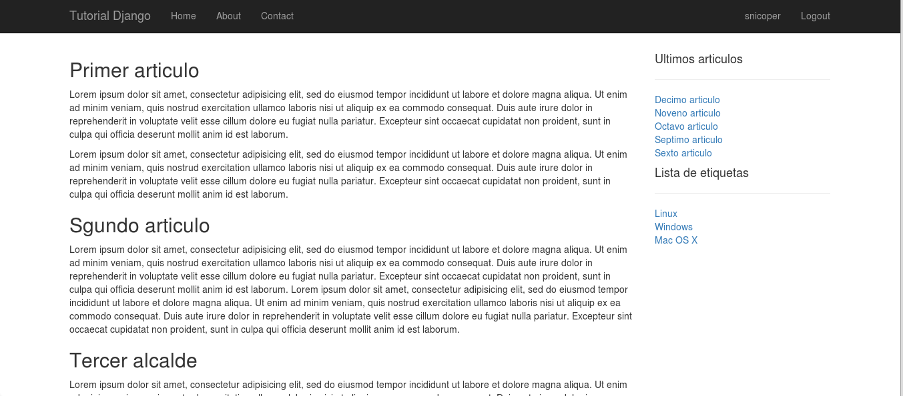
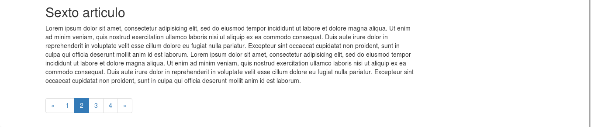

.. _reference-blog-class_base_view:

Clases basada en Vista ListView
===============================

TODO: Mejorar esta sección con documentación mejor explicada.

Las clases basadas en vista **CBV** aporta lo que aporta la **programación orientada a objetos**, herencia, mixins, etc. A parte de clases predefinidas que son solo 3 lineas de código es capaz de mostrar los datos de un modelo, y dar funcionalidad para actualizarlos.

Un mixin no es mas que una clase que ofrece una funcionalidad común a otras clases, pero que no pertenece a un tipo concreto.

A diferencia de las funciones **FBV**, una clase tiene métodos para las respuestas, por ejemplo, tiene un método ``get()`` y otra ``post()`` y dependiendo el método de la respuesta, usa uno u otro.

Las clases al tener herencia, podemos crear clases personalizadas con la misma funcionalidad (o similar) o crear nuestras **CBV**, pero por defecto tiene clases para las cosas mas comunes, como un sistema **CRUD** con, ``ListView``, ``UpdateView``, ``CreateView``, ``CreateView`` e incluso otras como ``FormView``. para las fechas o redireccionamiento.

ListView
********

Creo que lo mejor es mostrarlo, vamos a editar la única función de vista que tenemos en ``blog/views.py`` y la vamos a cambiar por una **CBV**.

.. code-block:: python

    # blog/views.py

    from django.views import generic

    from .models import Article

    class ArticleListView(generic.ListView):

        template_model = 'blog/article_list.html'
        model = Article
        context_object_name = 'articles'

En nuestra clase se ha añadido tres propiedades, pero por defecto solo es obligatorio uno, ``model = MiModel`` que es el modelo al que va leer los datos, pero para ser explicito se han añadido ``template_model`` que es la plantilla a renderizar y ``context_objects_name`` que sera el nombre de contexto con los elementos importados de la base de datos, en este caso un lista de ``Article``.

El siguiente paso es editar ``blog/urls.py``, eliminando la ``url()`` que contiene y cambiándola por

.. code-block:: python

    # blog/urls.py

    from django.conf.urls import url

    from . import view

    urlpatterns = [
        # /blog/ | /
        url(r'^$', views.ArticleListView.as_view(), name='blog.article_list'),
    ]

``regex`` es lo mismo, al igual que ``name``, lo único que cambia es la llamada a la vista ``views.ArticleListView.as_view()``, donde ``views`` es el modulo con las vistas, ``ArticleListView`` es la clase de la vista, que a su vez, es subclase de ``django.views.generic.ListView``, todas las vistas heredan de ``django.views.generic.View``, que es la **CBV** mas simple de todas y provee de un metodo (entre otros), ``as_view()`` que devuelve la vista con el plantilla renderizado.

Si probamos el sitio y vamos a la pagina principal, veremos que muestra exactamente lo mismo hacia con la función ``article_list_view``.

Posiblemente, en cuanto a lineas de código, pueda parecer que no valga la pena, pero este ejemplo ha sido simple y si conoces la **programación orientada a objetos**, conocerás sus ventajas.

Paginación
**********

Para continuar, vamos primero a añadir 10 artículos, asi que, ves a la administración y crea 9 artículos mas, ponle los títulos que quieras y usar un par de **lorem ipsum** en cada articulo (o los que quieras), en la parte de tags, ponle de 1 a 3 a tu gusto!.

Los 10 artículos creados desde la administrador.

Como se puede ver, la pagina donde muestra los articulo, muestra los 10 articulos, si hubieran 50, mostraria los 50, algo que pondria mas lenta las cargas de la pagina y gasto de ancho de banda.

Vamos a añadir una propiedad a la vista creada anterior mente, ``paginate_by``, que mandara como contexto a la plantilla información sobre paginación que usaremos mas tarde.

.. code-block:: python

    # blog/views.py

    class ArticleListView(generic.ListView):

        # ...
        paginate_by = 3

Ahora editamos la plantilla

.. code-block:: html

    <!-- blog/templates/blog/article_list.html -->

    <!-- Añadir debajo del  -->
    <nav>
        
            <ul class="pagination">
                
                    <li><a href="?page={{ page_obj.previous_page_number }}">&laquo;</a></li>
                

                
                    <li  class="active" >
                        <a href="?page={{i}}">{{ i }}</a>
                    </li>
                

                
                    <li><a href="?page={{ page_obj.next_page_number }}">&raquo;</a></li>
                
            </ul>
        
    </nav>

La vista pasa una variable de contexto ``is_paginated``, si devuelve ``True``, entonces es que hay paginación.

También pasa un objeto ``page_obj`` con métodos para obtener datos como si tiene mas pagina respecto a la actual ``page_obj.has_next`` o si tiene mas paginas previas a la actual ``page_obj.has_previous``. ``page_obj.number`` es la pagina actual, por lo que se puede comparar con la iteración de ``paginator.page_range`` que es el rango de paginas disponibles.

Y podemos ver, que ha generado un **Query string** en la **URI**, en este caso ``?page=2``

Con muy pocas lineas de código, hemos generado mucho, eso es innegable :)

También podemos observar que los artículos los muestra por orden de creación (por orden de ``id``), vamos a cambiar el orden.

.. code-block:: python

    # blog/views.py

    class ArticleListView(generic.ListView):

        # ...
        ordering = '-create_at'

Ahora, el orden es inverso al que mostraba antes los artículos :), tan solo con la propiedad ``ordering`` y como valor una propiedad del modelo.

Información del articulo
************************

Ahora, vamos añadir debajo del titulo del articulo, la fecha y autor. Toda esa información ya tenemos acceso desde la plantilla, así que vamos añadir el siguiente código.

.. code-block:: html

    <!-- blog/templates/blog/article_list.html -->

    <!-- Modificar el interior del  -->

    
        <h2>{{ article.title }}</h2>
        

            <small>
                <strong>Por: </strong>{{ article.owner.username }}
                <strong>Hace: </strong>{{ article.create_at|timesince }}
                <strong>El: </strong>{{ article.create_at|date:'d F Y' }}
            </small>

        

        
{{ article.body|safe }}

    

Lo hago simple y no genero **CSS** para centrarnos en lo importante.

En primer lugar, se puede ver lo facil que es acceder a los modelos relaciones con `article.owner.username``, la propiedad ``article.owner`` es devuelve ``django.contrib.auth.models.User``, que tiene acceso a ``username``, simplemente lo mostramos.

Por motivos de demostración, he añadido las 2 siguientes lineas, que maneja la fecha y hora de la propiedad ``create_at`` con filtros, el primer filtro ``timesince`` es una función que nos devuelve el tiempo que ha pasado desde la publicación hasta la fecha&hora actual. Con el filtro ``data`` se le pasa un argumento, que es un string y le decimos como representar la fecha y hora, puedes ver una lista de caracteres en la documentación de `PHP <http://php.net/manual/es/function.date.php>`_

Por ultimo, vamos a añadir, el **footer** del articulo con las etiquetas que tiene el articulo:

.. code-block:: html

    <!-- blog/templates/blog/article_list.html -->

    <!-- Modificar el interior del  -->

    
        <h2>{{ article.title }}</h2>
        

            <small>
                <strong>Por: </strong>{{ article.owner.username }}
                <strong>Hace: </strong>{{ article.create_at|timesince }}
                <strong>El: </strong>{{ article.create_at|date:'d F Y' }}
            </small>

        

        
{{ article.body|safe }}

        

            <strong>Etiquetas: </strong>{{ article.get_string_tags }}
        

    

Se puede observar, que es posible llamar a funciones del modelo (siempre que no requieran de parámetros) y el resultado es el siguiente:

En la siguiente sección, se añadirá una plantilla que muestra un único articulo seleccionado por el usuario (detalles) con sus comentarios.
