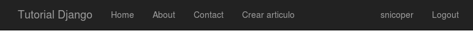
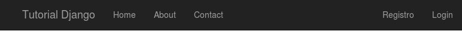
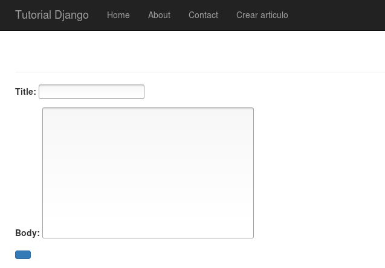
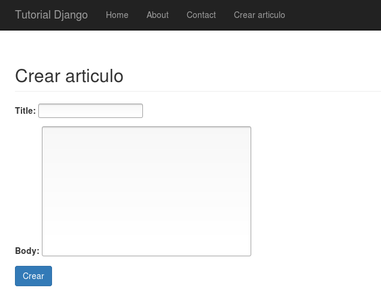
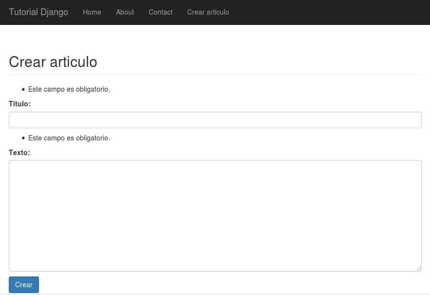
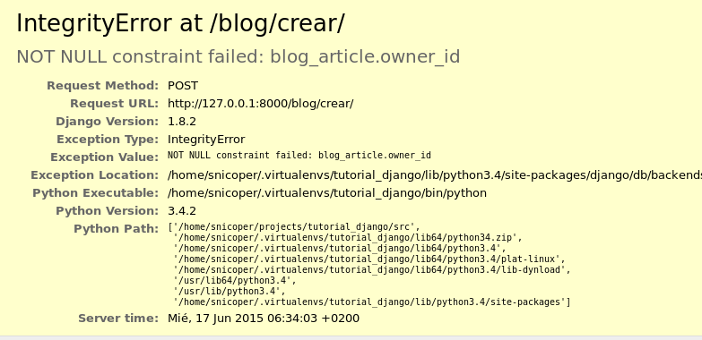

.. _reference-blog-creacion_articulo:

Creación de artículos CreateView
================================

A modo de demostración, vamos a crear en esta sección y las siguientes un sistema para añadir, editar y eliminar artículos. Con la administración Django, en este caso no seria necesario (la administración también controla permisos).

Vamos a empezar con la creación de artículos y comprobaremos si el usuario tiene permisos para añadir nuevos artículos, si no tiene permisos, crearemos una plantilla informando que **no tiene acceso**.

Va a ser rutinario, añadir la vista, crear la plantilla y añadir el **url**, así que por partes...

Creamos la vista, en esta ocasión, creamos una clase que deriva de ``CreateView``

.. code-block:: python

    # blog/views.py

    class ArticleCreateView(generic.CreateView):

        template_model = 'blog/article_form.html'
        model = Article

En este ocasión no añadimos la propiedad ``context_object_name`` que por defecto es ``form`` en una clase ``CreateView``.

La plantilla es ``article_form.html``, ya que la reutilizaremos con la vista de edición de artículos. Por este motivo, luego añadiremos un método mas a ``ArticleCreateView`` para ver como podemos añadir contexto personalizado.

.. code-block:: html

    <!-- blog/templates/blog/article_form.html -->

    

    {{ title }}

    
        <h2 class="page-header">{{ title }}</h2>
        <form action="" method="post">
            
            {{ form.as_p }}
            <button type="submit" class="btn btn-primary">{{ nombre_btn }}</button>
        </form>
    

Se puede observar variables de contexto ``{{ title }}`` que esta en 2 partes y ``{{ nombre_btn }}``, dentro de un rato volveremos a esto.

Vamos con al **URLconf** y añadir la **url**

.. code-block:: python

    # blog/urls.py

    urlpatterns = [
        # ...

        # /blog/crear/
        url(r'^crear/$', views.ArticleCreateView.as_view(), name='blog.crear'),
    ]

Y por ultimo, vamos a crear un botón en la barra de navegación superior, si tiene permisos para crear un articulo, saldrá el link.

.. code-block:: html

    <!-- templates/base.html -->

    <!-- debajo de <li><a href="#contact">Contact</a></li> añadimos -->

    
        <li><a href="#contact">Crear articulo</a></li>
    

``perms`` tambien esta disponible en las plantillas, y la forma de saber si un usuario tiene permisos es: ``perms.nombre_modelo.permiso``, donde ``nombre_modelo`` es el nombre del modelo en minúsculas y ``permiso`` es uno de los siguientes:

* ``can_add``: Puede añadir
* ``can_change``: Puede cambiar (editar)
* ``can_delete``: Puede eliminar

Si probamos y vamos primero a `http://127.0.0.1:8000/ <http://127.0.0.1:8000/>`, si estamos logueados, veremos un link para crear un articulo.

Y si estamos deslogueados, no mostrara el link

Si pinchamos encima de **Crear articulo** veremos que nos mostrara un error! `http://127.0.0.1:8000/blog/crear/ <http://127.0.0.1:8000/blog/crear/>`_ el error es por que Django 1.8 obliga añadir la propiedad ``fields`` (en este caso dentro de la vista, pero podría ser también en un ``ModelForm``), con los campos que vamos a mostrar.

Así que, vamos a añadir en la vista la siguiente linea:

.. code-block:: python

    # blog/views.py

    class ArticleCreateView(generic.CreateView):

        template_model = 'blog/article_form.html'
        model = Article
        fields = ('title', 'body')

Si actualizamos la pagina, veremos que nos muestra un formulario con los campos que queríamos que mostrase.

Podemos ver varias cosas, primero lo fácil que ha sido crear un formulario a partir de un modelo!, con la clase ``CreateView``, segundo, donde esta el titulo de la pagina?, y ¿un botón sin texto? :)

Vamos añadir contexto en ``ArticleCreateView``, para ello, vamos a usar un método ``get_context_data()``

.. code-block:: python

    # blog/views.py

    class ArticleCreateView(generic.CreateView):

        # ...

        def get_context_data(self, **kwargs):
            # Obtenemos el contexto de la clase base
            context = super().get_context_data(**kwargs)
            # añadimos nuevas variables de contexto al diccionario
            context['title'] = 'Crear articulo'
            context['nombre_btn'] = 'Crear'
            # devolvemos el contexto
            return context

y podemos ver los resultados

De esta manera, podemos mas tarde reutilizar la plantilla cuando hagamos la de edición.

¿Y el **slug** y el propietario (**owner**)? bueno, el **slug**, si recuerdas, se genera automáticamente cuando se crea/guarda el objeto y el **owner**, lo recuperaremos mas tarde del usuario que esta logueado (que actualmente tenemos un problema, por que cualquiera puede crear un articulo, luego lo arreglamos)

Otra cosa que podemos apreciar, es el diseño de los elementos del formulario, no tienen el diseño de **Bootstrap!** como antes :(, a parte los campos tienen un nombre **no muy útil** para los usuarios.

Empezaremos por lo nombres de los campos (**labels**), en principio, añade el nombre del campo del modelo, en este caso de ``blog.models.Article``, pero es posible cambiar el nombre en el mismo modelo.

.. code-block:: python

    # blog/models.py

    class Article(models.Model):

        # Remplazamos
        title = models.CharField(max_length=100, unique=True)

        # por
        title = models.CharField(verbose_name='titulo', max_length=100, unique=True)

El del ``body``, lo dejamos para el formulario, para demostrar otra posibilidad de hacerlo.

En **accounts** creamos los formularios con subclases de ``django.forms.Form``, pero hay otra manera cuando se crean formularios que son parte de un modelo (como es el caso), vamos a crear un formulario ``ArticleCreateForm`` que es subclase de ``django.forms.ModelForm``.

.. code-block:: bash

    touch blog/forms.py

.. code-block:: python

    # blog/forms.py

    from django import forms

    from .models import Article

    class ArticleCreateForm(forms.ModelForm):

        class Meta:
            model = Article
            fields = ('title', 'body')
            labels = {
                'body': 'Texto'
            }
            widgets = {
                'title': forms.TextInput(attrs={'class': 'form-control'}),
                'body': forms.Textarea(attrs={'class': 'form-control'})
            }

Como se puede apreciar, las opciones de formulario están en la clase ``Meta``, donde el ``model`` es el modelo, en este caso ``Article``, ``fields`` una tupla o lista con los campos a mostrar, ``labels``, al igual que en el modelo usábamos ``verbose_name``, en los formularios es ``labels``, un diccionario con la clave (el nombre del campo/elemento) y el valor (el texto a mostrar). Por ultimo vemos los ``widgets``, también un diccionario donde la clave es el nombre del campo y el valor es el tipo de campo que queremos con un argumento ``attrs`` con los atributos que insertara en el elemento del formulario.

Si actualizamos la pagina, nos dará un error diciendo que no podemos tener ``fields`` en 2 sitios, así que quitamos ``fields = ('title', 'body')`` en la vista ``ArticleCreateView``.

Vamos añadir un método en la vista, el método se ejecuta después de **instanciar** la clase, para determinar el tipo **method** de la solicitud.

.. code-block:: python

    # blog/views.py

    # Añadimos al inicio
    from django.shortcuts import redirect
    from django.conf import settings

    class ArticleCreateView(generic.CreateView):

    # ...

    def dispatch(self, request, *args, **kwargs):
        # Nota: Dejo para el lector como ejercicio que cambie este
        # comportamiento, actualmente, solo comprueba si es usuario
        # tiene permisos para añadir un articulo, si no lo tiene, lo
        # redirecciona a login, pero, ¿y si esta logueado y simplemente
        # no tiene permisos?
        # El compportamiento logico seria:
        #   ¿Estas logueado?
        #       ¿Tiene permisos?
        #           Continuar con la ejecución
        #       ¿No tienes permisos?
        #           Redireccionar a una pagina informando que no tiene permisos
        #           para añadir un articulo.
        #   Si no estas logueado:
        #       Redireccionar a pagina de login
        if not request.user.has_perms('blog.add_article'):
            return redirect(settings.LOGIN_URL)
        return super().dispatch(request, *args, **kwargs)

``has_perms('blog.add_article')`` a diferencia de las plantillas, se le pasa un argumento como **string** con el **nombre_app.tipopermiso_nombremodelo** donde **tipopermiso** es ``add_``, ``change_`` y ``delete_`` (por defecto).

Si vamos a la web, estando logueados y le damos al botón de **Crear**, vemos el formulario se valida, y si no pasa la validación, recarga otra vez el formulario indicando los errores.

La validación va en este orden, ``ModelForm`` sobrescribe a ``Model`` (otra cosa es que luego nos mande un error el modelo por no cumplir los **requisitos**).

Vamos a crear un articulo, ponemos un **Titulo** y ponemos algo en **Text** y le damos al botón **Crear**

**OPS!**, se nos ha olvidado asignar a **owner** al articulo!

``CreateView`` tiene dos métodos ``form_valid(self, form)`` y form_invalid(self, form)``, que podemos tomar decisiones si el formulario se ha validado con éxito o no.

En este caso, queremos hacer algo cuando sea valido, asignar el usuario actual a **owner**.

.. code-block:: python

    # blog/views.py

    class ArticleCreateView(generic.CreateView):

    # ...

    def form_valid(self, form):
        form.instance.owner = self.request.user
        return super().form_valid(form)

``form.instance`` es un objeto del modelo (una propiedad de ``FormModel``), pero aun no se ha guardado. (Puede parece un lío), después de ejecutar ``CreateView.form_valid``, se ejecutara ``FormModel.save()`` que a su vez, ejecutara ``Model.save()``

Por ultimo, cuando todo lo anterior termina bien, ``ArticleCreateView`` tiene una propiedad ``success_url`` y un método ``get_success_url()``, si no tiene datos, ni el método ni la propiedad (es la **url** de redirección en caso de éxito), intentara obtener ``Model.get_absolute_url()``, si no se tuviera declarado al menos 1 de las 3 opciones, lanzara un error, por que no sabe donde queremos ir después de crear el articulo. En este caso, tenemos declarada en el modelo ``get_absolute_url()``, sera donde redireccionara cuando todo haya salido bien, que sera a detalles del articulo.

En la siguiente sección, vamos a poner la opción de editar el articulo
