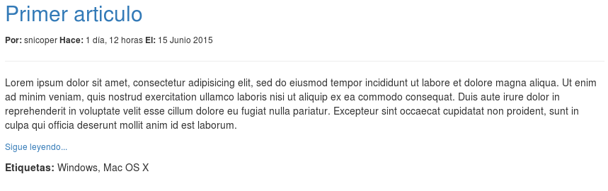
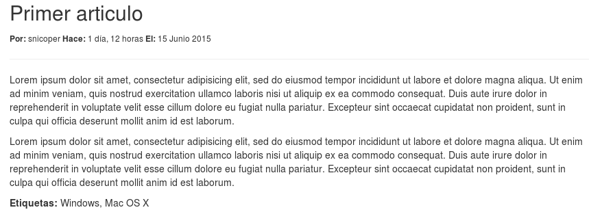

.. _reference-blog-crear_filtro:

Creación de un filtro
=====================

Vamos a crear un filtro personalizado, vamos a crear el típico **leer mas...**, que sera un link para leer el articulo entero. En la lista de artículos, los artículos se cortaran donde pongamos una marca ``<!-- read_more -->``. El filtro comprobara si tiene un ``<!-- read_more -->``, si lo tiene, cambiara ese texto por un link hacia **detalles del articulo**.

Primero, vamos añadir un método al modelo ``Article``, ``get_absolute_url``

.. code-block:: python

    # blog/models.py

    # Añadir al inicio
    from django.core.urlresolvers import reverse

    class Article(models.Model):

        # ...

        def get_absolute_url(self):
            return reverse('blog.article_detail', kwargs={'slug': self.slug})

Primero importamos del modulo ``urlresolvers`` la función ``reverse``, que generara una **URI** en base al archivo **URLconf**, el primer parámetro es el ``name`` de ``url()`` y el segundo parámetro es un diccionario ``kwargs`` con los argumentos de ``regex`` ``(?P<slug>[-\w]+)``, en este caso requiere un **slug**, por lo tanto se le pasa el nombre (el parámetro de ``regex``) y el valor, en este caso ``self.slug``.

La función, como veremos, no es una invención o convención nuestra, pertenece a ``django.db.models.Model`` y es utilizada a menudo como iremos viendo.

Los filtros, se crean en el mismo archivo que las **inclusion_tag**, es decir, en el archivo ``nombre_app/templatetags/app_tags.py``, en este caso en ``blog/templatetags/blog_tags.py``.

.. code-block:: python

    # blog/templatetags/blog_tags.py

    @register.filter
    def read_more(article):
        pattern = '<!-- read_more -->'
        body = article.body
        if pattern in body:
            pos = body.index(pattern)
            replace = '<a href="{}" class="small">Sigue leyendo...</a>'.format(
                article.get_absolute_url())
            body_return = body.replace(pattern, replace)
            return body_return[:pos + len(replace)]
        return body

Y modificamos la plantilla ``_article.html``

.. code-block:: html

    <!-- blog/templates/blog/_article.html -->

    <!-- cambiamos 
{{ article.body|safe }}
 por -->
    
        
{{ article|read_more|safe }}

    
        
{{ article.body|safe }}

    

¿Como funciona?, el filtro ``read_more`` es una simple función Python que requiere de un parámetro ``article``, espera un objeto ``blog.models.Article``.

La función (o filtro), lo único que hace es buscar un substring ``<!-- read_more -->``, si lo encuentra sustituye ``<!-- read_more -->`` por un link. El link es generado gracias al método ``get_absolute_url`` del objeto ``Article``.

La plantilla, usamos la misma técnica anterior, si existe un contexto ``articles``, significa que estamos en la plantilla ``article_list.html`` y llamamos al filtro de la siguiente manera ``{{ article|read_more|safe }}``.

``read_more``, como hemos comentado, requiere un parámetro, un objeto ``Article``, los filtros se aplican a la parte izquierda del filtro ``se_aplica|filtro``. En este caso el **se_aplica** es pasado como primer argumento (en este caso, un objeto ``Article``).

Ademas, podemos observar que los filtros pueden a su vez tener otros filtros, a la devolución de ``article|read_more`` que ahora es un **string**, le aplicamos el filtro ``safe`` anteriormente comentado.

Si estamos llamando a la plantilla desde ``article_detail.html``, la variable de contexto ``articles`` no existe, por lo que se ejecutara ``{{ article.body|safe }}``.

Aquí podemos ver el resultado

En la siguiente sección, vamos a ver como crear artículos.
