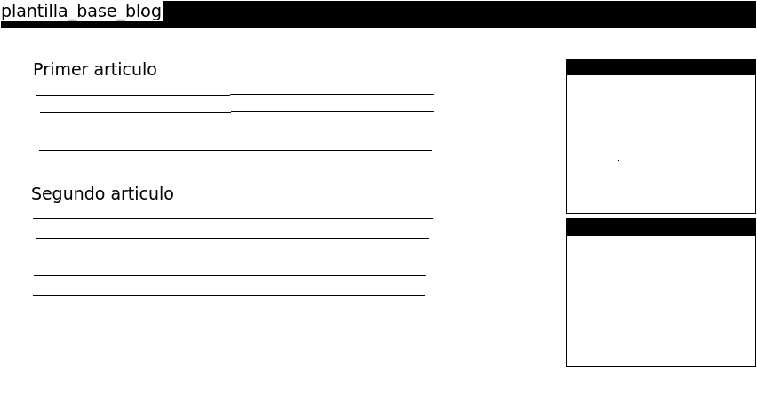
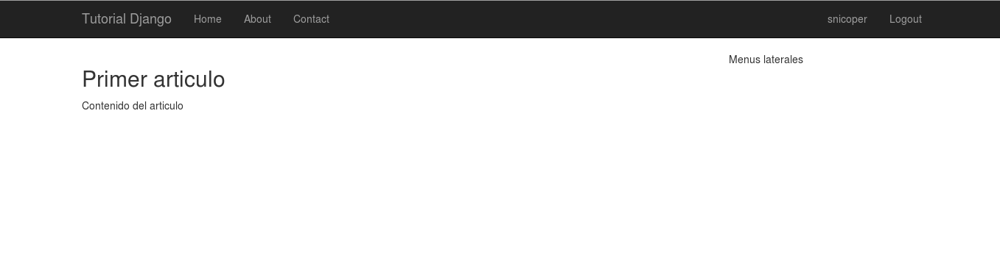
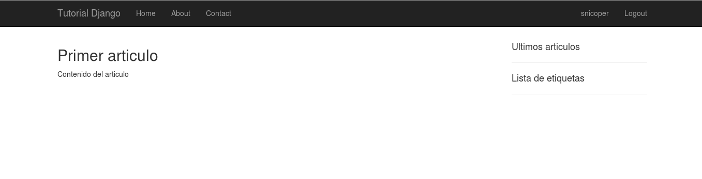
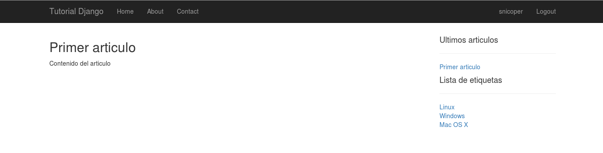
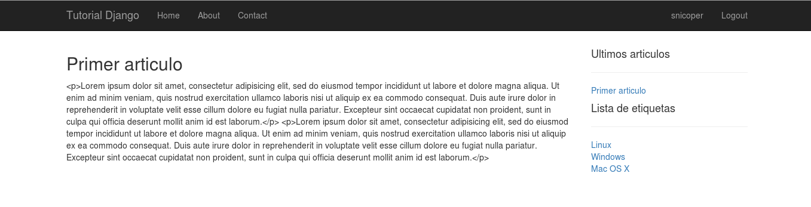
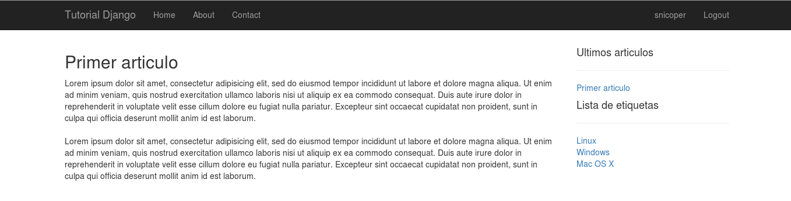

.. _reference-accounts-plantilla_base_blog:

Preparar plantilla base_blog.html
=================================

Al igual que hicimos con las plantillas en **accounts**, cuando creemos ``accounts/base_accounts.html`` como base de para el perfil de usuario, aquí haremos lo mismo, en realidad algo parecido.

Primero una idea de lo que queremos hacer

La barra de navegación superior es la misma que en todo el sitio, el bloque central, sera donde mostraremos la lista de articulo o un articulo en detalle (que serán las plantillas normales con ``extends 'base.html'``) y los bloques laterales, donde, por ejemplo, podemos crear una lista de ultimas entradas o lista de etiquetas o cualquier cosa que se nos ocurra.

Los bloques laterales es lo que hay de diferente en el sitio hasta el momento y añadirlos en todas las platillas seria un curro grande, sin contar que una modificación, significaría modificar todas las paginas que tengan esos bloques.

A diferencia de **accounts**, que incluíamos el bloque con contenido estático con un ````, aquí puede ser dinámico, intento explicarme...

Hay dos maneras de pasar contenido, la primera es a través del contexto cuando renderizamos una plantilla a través del método ``render()``, eso significaría estar pasando los datos de **ultimas entradas** y **lista de etiquetas** y eso seria molesto, seria incluir ese contexto en todas las vistas.

Hay una manera para solucionar esto y es con ``inclusion_tag``. Con una **inclusion tag** podemos tener acceso a una plantilla que generara los datos de manera dinámica sin importarnos el contexto pasado en las vistas.

Vamos a empezar por el principio, creamos el ``base_blog.html`` para crear la estructura de la **app blog**.

.. code-block:: bash

    touch blog/templates/blog/base_blog.html

.. code-block:: html

    # <!-- blog/templates/blog/base_blog.html -->

    

    
        

            

                
            

            

                
            

        

    

Ahora, vamos a crear el **index** para el blog, que sera el que muestra la lista de artículos.

.. code-block:: bash

    touch blog/templates/blog/article_list.html

.. code-block:: html

    # <!-- blog/templates/blog/article_list.html -->

    

    Blog - Lista de articulos

    
        <h2>Aqui mostrar la lista de articulos</h2>
    

Creamos un archivo de plantilla, para crear los menús laterales

.. code-block:: bash

    touch blog/templates/blog/_menus.html

    
Menus laterales

De momento, aunque sin funcionalidad, ya esta mas o menos preparado, separando los componentes de plantilla, para hacerlos mas fáciles de modificar y que un cambio, se refleje en varias paginas.

Vamos a crear la vista, a modo de demostración, vamos a crear una clase basada en función, pero que mas tarde cambiaremos a una vista basada en clase.

.. code-block:: python

    # blog/views.py

    from django.shortcuts import render

    from .models import Article

    def article_list_view(request):
        articles = Article.objects.all()
        context = {'articles': articles}
        return render(request, 'blog/article_list.html', context)

Nada nuevo, obtenemos todos los artículos del modelo ``Article`` los añadimos a un diccionario para el contexto y renderizamos la pagina ``blog/article_list.html``

Ahora **article_list.html**, para mostrar los artículos típico de los blogs, titulo y el contenido, así que modificamos el archivo, quedando de esta manera.

.. code-block:: html

    # <!-- blog/templates/blog/article_list.html -->

    

    Blog - Lista de articulos

    
        
            <h2>{{ article.title }}</h2>
            
{{ article.body }}

        
    

Se puede ver que es posible iterar sobre elementos en las plantillas, una variable de contexto es ``articles``, un objeto ``django.db.models.query.QuerySet`` iterable, por lo que podemos recorrer sus elementos (filas de datos), es igual que un ``for`` Python, lo único diferente es la forma de crearlos en las plantillas con los caracteres ```` (**tags**) y que contiene una etiqueta de cierre ```` obligatoria.

Recorre todos sus elementos y podemos acceder a las propiedades con las sintaxis de punto ``.`` como lo haríamos en Python.

Como ya vimos en **accounts**, la forma de imprimir una variable es encerrando la variable entre llaves ``{{  }}``.

Para probarlo, tenemos que añadir en el **URLconf** principal ``tutorial_django/urls.py`` las **urls** del blog, haremos un pequeño cambio, pondremos el blog como pagina principal.

.. code-block:: python

    # tutorial_django/urls.py

    # ...

    urlpatterns = [
        url(r'^$', include('blog.urls')),
        url(r'^blog/', include('blog.urls')),
        url(r'^home/', include('home.urls')),
        url(r'^accounts/', include('accounts.urls')),
        url(r'^admin/', include(admin.site.urls)),
    ]

    # ...

Ahora insertamos en ``blog/urls.py`` la **url** para la vista creada.

.. code-block:: python

    # blog/urls.py

    from django.conf.urls import url

    from . import views

    urlpatterns = [
        # /blog/ | /
        url(r'^$', views.article_list_view, name='blog.article_list'),
    ]

Vamos también a modificar ``templates/base.html`` para poner los links.

.. code-block:: html

    <!-- templates/base.html -->

    <!-- buscamos la parte -->
    <a class="navbar-brand" href="#">Project name</a>

    <!-- y la remplazamos por -->
    <a class="navbar-brand" href="">Tutorial Django</a>

    <!-- buscamos la parte -->
    <ul class="nav navbar-nav">
        <li class="active"><a href="#">Home</a></li>
        <li><a href="#about">About</a></li>
        <li><a href="#contact">Contact</a></li>
    </ul>

    <!-- y la remplazamos por -->
    <ul class="nav navbar-nav">
        <li><a href="">Home</a></li>
        <li><a href="#about">About</a></li>
        <li><a href="#contact">Contact</a></li>
    </ul>

Vemos que para crear links vasta con usar el **tag** ```` donde ``nombre_url`` es el ``name='nombre_url'`` de las funciones ``url()`` en ``urlpatterns = []`` de los archivos ``urls.py``, de esta manera, si cambiamos una vista a otra, no tendremos que cambiar el link **html** en todas las plantillas (un lujo) como se podrá observar mas tarde cuando cambiemos la vista ``article_list_view``.

Si probamos ahora, con el servidor en marcha, vamos a `http://127.0.0.1:8000 <http://127.0.0.1:8000>`_ vemos que ahora muestra los artículos en un lado y un espacio para luego insertar los menús en el lado lateral (en este caso a la derecha).

El siguiente paso, seria crear la **inclusion tag**, para ello, vamos a crear un directorio ``templatetags`` dentro de la raíz de la **app blog** y dentro, el archivo ``__init__.py`` para que Python lo trate como un modulo y otro ``blog_tags.py`` donde crearemos nuestra **inclusion tag**.

.. code-block:: bash

    mkdir blog/templatetags
    touch blog/templatetags/{__init__.py,blog_tags.py}

.. code-block:: python

    # blog/templatetags/blog_tags.py

    from django import template

    from ..models import Article, Tag

    register = template.Library()

    @register.inclusion_tag('blog/_menus.html')
    def get_menus_blog():
        context = {
            # Obtener lista completa de etiquetas
            'lista_tags': Tag.objects.all(),
            # Obtener las 5 ultimas entradas
            'ultimos_articulos': Article.objects.order_by('-create_at')[:5]
        }
        return context

Importamos el modulo ``template`` y los modelos ``Article`` y ``Tag``, creamos una instancia de ``Library`` para mas tarde usarlo como decorador ``@register.inclusion_tag('blog/_menus.html')`` pasándole como argumento la plantilla que usara para la representación de los datos devueltos por la función ``get_menus_blog``, dentro generamos un contexto con dos elementos, ``lista_tags`` con todas las etiquetas en la base de datos y ``ultimos_articulos`` con los últimos 5 artículos.

.. note::

    ``order_by()`` obtiene todos los elementos ordenados por el argumento, en este caso ``create_at``, por defecto, se obtienen de manera ascendente, al incluir un guion **'-'**, los datos obtenidos serán de manera descendente.

Ahora nos queda leer los datos y representarlos, modificamos la plantilla ``blog/templates/blog/_menu.html`` teniendo en mente que tendremos acceso al contexto devuelto por ``get_menus_blog``

.. code-block:: html

    <!-- blog/templates/blog/_menu.html -->

    

        <h4>Ultimos articulos</h4>
        

        
            <a href="#">{{ articulo.title }}</a> 
        
    

    

        <h4>Lista de etiquetas</h4>
        

        
            <a href="#">{{ tag.name }}</a> 
        
    

Si actualizamos la pagina, vemos que no muestra los resultados, debido a que debemos incluir en el template ``blog_tags``

Lo incluimos en ``blog/templates/blog/base_blog.html``

.. code-block:: html

    <!-- blog/templates/blog/base_blog.html -->

    <!-- Añadimos al inicio del documento -->
    
     <!-- añadir -->

    <!-- Eliminamos  y lo cambiamos por -->
    {% get_menus_blog %

Si ahora, actualizamos la pagina, veremos lo siguiente:

Primero se ha de leer las **tags** ````, da igual donde se ponga, lo importante es ponerlas antes de la llamada a la función que queremos usar, en este caso ```` con sintaxis de **tag** ````.

Vemos a editar el articulo **Primer articulo** desde la administración de Django, el titulo lo dejamos igual y el contenido el campo **body**, le añadimos 2 **lorem ipsum** separándolos con un espacio (2 párrafos)

    
Lorem ipsum dolor sit amet, consectetur adipisicing elit, sed do eiusmod
    tempor incididunt ut labore et dolore magna aliqua. Ut enim ad minim veniam,
    quis nostrud exercitation ullamco laboris nisi ut aliquip ex ea commodo
    consequat. Duis aute irure dolor in reprehenderit in voluptate velit esse
    cillum dolore eu fugiat nulla pariatur. Excepteur sint occaecat cupidatat non
    proident, sunt in culpa qui officia deserunt mollit anim id est laborum.

Si nos fijamos en la imagen:

se puede observar, como en realidad lo muestra como un solo párrafo, eso es porque por defecto, Django, no permite **html** por razones de seguridad, si miras el código generado en el navegador, veras que 
 lo traduce a ``&lt;p&gt;`` (entidades html), pero en este caso (hemos creado nosotros la entrada, no un usuario desconocido!, nunca te fíes de un usuario, puede comenter errores involuntarios... o no...), vamos a permitir **html** en las entradas. Para ello, usaremos uno de lo muchos `filtros <https://docs.djangoproject.com/en/1.8/ref/templates/builtins/#filters>`_ que tiene por defecto Django (a parte nosotros podemos crear nuestros propios filtros). El filtro que usaremos es `safe <https://docs.djangoproject.com/en/1.8/ref/templates/builtins/#safe>`.

Volvemos a la plantilla y añadimos el filtro

.. code-block:: html

    <!-- blog/templates/blog/article_list.html -->

    <!-- añadimos el filtro a {{ article.body }} -->
    
{{ article.body|safe }}

Los filtros se añaden con los ¿pipers? **'|'** al elemento que quieres que se aplique, en este caso es al ``article.body``, con ``safe`` no convierte el html a entidades.

Si ahora actualizamos la pagina, vemos que ahora esta mucho mejor!

.. note::

    Otra opción, que es la que prefiero, es usar el filtro ``linebreaksbr`` y en el articulo puedo omitir poner 
 y 
, lo que hace es sustituir el final de linea ``\n`` por `` ``.

    Yo utilizo **markdown** para crear el contenido, `puedes ver un articulo que cree para añadir markdown a Django <http://www.snicoper.com/blog/article/incluir-markdown-en-django/>`_.

Ahora es el momento para ver las **CBV**, pero lo dejamos para la siguiente sección!
