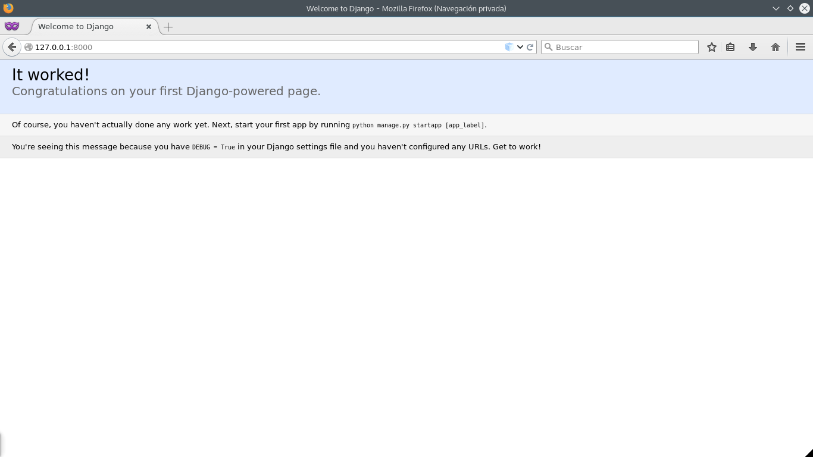
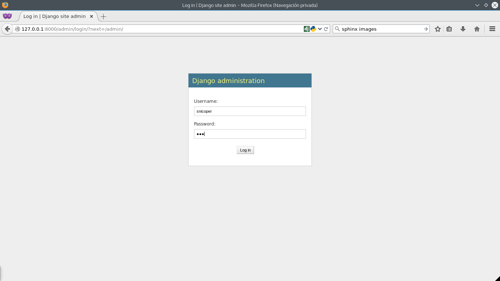
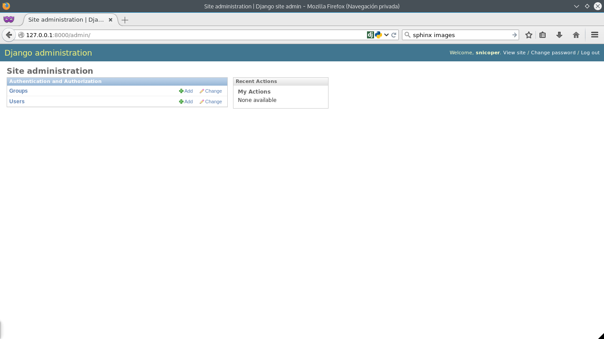
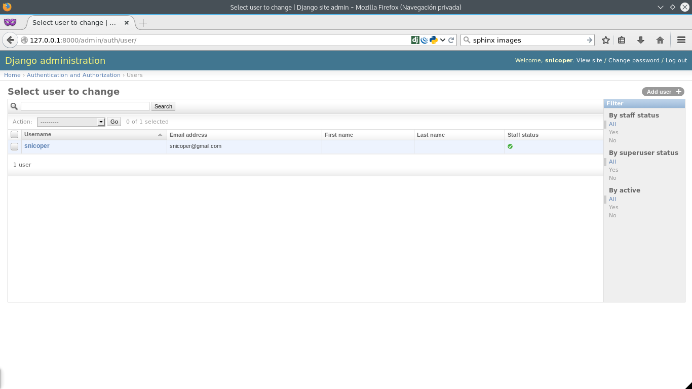

.. _reference-creacion_proyecto:

.. raw

Creación de un proyecto Django
==============================

Vamos a crear un proyecto, nos desplazamos desde la terminal hasta el directorio donde vayamos a crear el proyecto y ejecutamos:

.. code-block:: bash

    django-admin startproyect tutorial_django

.. note::

    Si el comando anterior da algún error, probar con ``python django-admin.py startproyect tutorial_django``

Esto nos crea un directorio con la siguiente estructura:

.. code-block:: bash

    tutorial_django/
    ├── manage.py
    └── tutorial_django
        ├── __init__.py
        ├── settings.py
        ├── urls.py
        └── wsgi.py

    1 directory, 5 files

``tutorial_django`` es la raíz del proyecto y ese directorio se puede renombrar tranquilamente, para diferenciarlo con el que hay en el interior con el mismo nombre, lo renombramos a ``src``.

.. code-block:: bash

    mv tutorial_django src

``manage.py`` es un archivo Python que se encarga de poner el proyecto en ``sys.path``, establecer la variable de entorno `DJANGO_SETTINGS_MODULE <https://docs.djangoproject.com/en/1.8/topics/settings/#envvar-DJANGO_SETTINGS_MODULE>`_ para que apunte al archivo ``settings.py`` y llama a `django.setup() <django.setup()>`_.

.. note::

    En linux, en principio ``manage.py`` tiene permisos de ejecución, en caso de no tenerlos ``chmod +x manage.py``

Todos los comandos (poco a poco veremos unos cuantos) que se pasan a ``manage.py`` son pasados a ``django-admin`` estableciendo los parámetros del párrafo anterior, por lo tanto es un wrapper de ``django-admin``.

.. note::

    Para ver la lista de argumentos de ``manage.py`` usar ``./manage.py help``

Dentro de ``src`` hay otro directorio con el mismo nombre ``tutorial_django`` y cuatro archivos mas, el directorio es posible cambiarle el nombre, pero abría que cambiar algunos parámetros en ``manage.py``, nosotros lo dejaremos tal y como esta.

| ``__init__.py`` es para decirle que trate ``tutorial_django`` como un paquete Python.
| ``settings.py`` aquí pondremos/cambiaremos las configuraciones del sitio.
| ``urls.py`` archivo URLconf, aquí es donde manejaremos las rutas que apuntan a las vistas.
| ``wsgi.py`` WSGI en pocas palabras es una interfaz entre un servidor web y la propia aplicación, no hablaremos mas sobre este tema en este tutorial.

Primera migración
*****************

Una de las primeras cosas que se hace después de crear un proyecto Django, es elegir el motor de base de datos en la que almacenaremos todos nuestros datos, decir a Django que RDBMS vamos a usar, en ``tutorial_django/settings.py``, buscamos la zona donde esta la configuración de ``DATABASES``.

Para este tutorial usaremos el mas simple, ``SQLite`` que es la que viene por defecto, pero si quieres usar otro distinto puedes ver de la `documentación <https://docs.djangoproject.com/en/1.8/ref/settings/#databases>`_

La configuración por defecto:

.. code-block:: python

    DATABASES = {
        'default': {
            'ENGINE': 'django.db.backends.sqlite3',
            'NAME': os.path.join(BASE_DIR, 'db.sqlite3'),
        }
    }

Ahora, tenemos que hacer la primera migración y la creación de un administrador, para la migración usamos el siguiente comando.

.. code-block:: bash

    ./manage.py migrate

Esto nos crea las tablas de algunas aplicaciones que vienen por defecto en Django (si quieres ver las apps que se usan en Django, puedes mirar en el archivo ``settings.py`` en la tupla ``INSTALLED_APPS``).

Si usas el gestor de la base de datos que hayas elegido, puedes ver que se han creado varias tablas en la base de datos, tambien has podido ver que tablas se han creado, con la salida de ``./manage.py migrate``

.. code-block:: bash

    Operations to perform:
      Synchronize unmigrated apps: staticfiles, messages
      Apply all migrations: sessions, admin, auth, contenttypes
    Synchronizing apps without migrations:
      Creating tables...
        Running deferred SQL...
      Installing custom SQL...
    Running migrations:
      Rendering model states... DONE
      Applying contenttypes.0001_initial... OK
      Applying auth.0001_initial... OK
      Applying admin.0001_initial... OK
      Applying contenttypes.0002_remove_content_type_name... OK
      Applying auth.0002_alter_permission_name_max_length... OK
      Applying auth.0003_alter_user_email_max_length... OK
      Applying auth.0004_alter_user_username_opts... OK
      Applying auth.0005_alter_user_last_login_null... OK
      Applying auth.0006_require_contenttypes_0002... OK
      Applying sessions.0001_initial... OK

Creación del super usuario
**************************

Ahora que tenemos nuestra primera migración en nuestra base de datos y por consiguiente la tabla ``auth_user``, vamos a crear el super usuario, desde la terminal ejecutamos ``./manage.py createsuperuser``

.. code-block:: bash

    $ ./manage.py createsuperuser
    Username (leave blank to use 'snicoper'):
    Email address: snicoper@gmail.com
    Password:
    Password (again):
    Superuser created successfully.

Vamos a ver si todo ha salido bien, o como se esperaba. Para ello se usa el comando ``runserver``

.. code-block:: bash

  ./manage.py runserver

.. warning::

  Django tiene un servidor escrito en Python exclusivamente para el desarrollo, cada vez que se modifica un archivo, el servidor se reinicia y recompila los archivos, ahorrandonos mucho tiempo y molestias, pero eso solo eso, un servidor para desarrollo, que soporta una o unas pocas peticiones, **no lo uses para un servidor de produccion!** para eso tienes Nginx, Apache entre otros.

Accedemos en el navegador a la url `http://127.0.0.1:8000 <http://127.0.0.1:8000>`_ y si todo ha salido bien, veras una pantalla como la siguiente:

También podemos ver la administración que viene incorporada con Django y que ahorra muchas horas de trabajo, genera un sistema ``CRUD`` simplemente genial, para acceder a la administración vamos a la url `http://127.0.0.1:8000/admin/ <http://127.0.0.1:8000/admin/>`_

Eso es todo!, ya tenemos un proyecto creado, nuestra primera migración y creado el super usuario (administrador) del sitio con uno pocos pasos.

Mas adelante, modificaremos ``settings.py`` y ``urls.py`` y los veremos mas en detalle, ahora vamos a crear nuestra primera aplicación.
