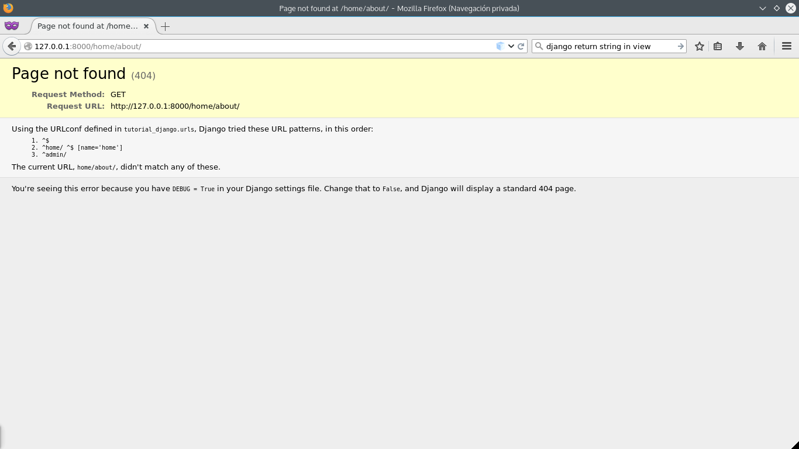

.. _reference-urls:

URLs
====

Se puede ver en ``tutotial_django/settings.py`` una variable ``ROOT_URLCONF = 'tutorial_django.urls'``, esto es el punto de entrada a las rutas en la barra de navegación del navegador. Cuando insertamos una **URI** en el navegador (o pinchamos algún link), Django obtiene la **URI** y la va comparando con expresiones regulares con el archivo ``tutorial_django/urls.py`` y si hay coincidencia, cagara la vista asociada al patrón, en caso contrario mostrara un **error 404**.

Este archivo es solo un punto de entrada y algo cómodo (que ademas mantiene al máximo el desacoplamiento), es crear un archivo ``urls.py`` en cada **app** y en ``tutorial_django/urls.py`` indicar que se ha creado otro archivo **urls** para que siga comprobando.

Primero decimos a ``tutorial_django/urls.py`` que vamos a crear un archivo con **urls** y donde encontrar el archivo, a parte pondremos parte de un patrón.

Echemos un ojo al archivo que crea por defecto Django al crear proyecto.

.. code-block:: python

    # tutorial_django/urls.py

    from django.conf.urls import include, url
    from django.contrib import admin

    urlpatterns = [
        url(r'^admin/', include(admin.site.urls)),
    ]

``urlpatterns`` es una lista que contiene un conjunto de funciones ``url()``, en este caso, se le pasan dos parámetros ``r'^admin/'`` que es el patrón, una expresión regular que luego comparara con la **URI** que insertamos en el navegador e ``include(admin.site.urls)`` que es una función para 'incluir' otros **URLconf**.

En el argumento de ``regex``, es una expresión regular pura en Python, por lo que no debemos aprender otros tipo de patrones!.

Para entender como funciona esto (a ver si yo me se explicar, que es lo difícil de verdad :P), vamos a crear nuestro archivo ``home/urls.py`` y le insertamos el siguiente código.

.. code-block:: python

    # home/urls.py

    from django.conf.urls import url

    from . import views

    urlpatterns = [
        # /home/
        url(regex=r'^$', view=views.index_view, name='home'),
    ]

Tenemos que incluir este archivo **URLconf** al **URLconf** principal ``tutorial_django/urls.py``

.. code-block:: python

    # tutorial_django/urls.py

    from django.conf.urls import include, url
    from django.contrib import admin

    urlpatterns = [
        url(r'^$', include('home.urls')),
        url(r'^home/', include('home.urls')),
        url(r'^admin/', include(admin.site.urls)),
    ]

En este ultimo **URLconf**, hemos añadido dos ``url()``, con una expresión regular ``^$`` que coincidirá con la **URI** '/' (vació) y la otra que coincidirá con la **URI** 'home/', e 'incluirán' ``home/urls.py`` y sera nuestra pagina principal.

Ahora, imaginamos que ponemos en el navegador ``http://127.0.0.1:8000/home/about/``, ¿como funcionan las comparaciones?, en primer lugar Django separa la parte del dominio con el resto, es decir se queda con la `URI <http://es.wikipedia.org/wiki/Identificador_de_recursos_uniforme>`_, que en este caso es ``/home/about/`` y empieza a compararlas con ``tutorial_django/urls.py``, va de arriba hacia abajo en las ``url()``.

En primer lugar compara ``/home/about/`` con el patrón ``r'^home/'`` y ya encuentra una coincidencia, que es ``home/``, ahora, parte el string y se queda con el resto, en este caso ``about/``. Pero ahora, continua las comparaciones con los patrones en ``home/urls.py``. En ``home/urls.py``, no encontrara ninguna coincidencia, por lo que volverá a ``tutorial_django/urls.py``, cuando termine, no abra encontrado nada, así que devolverá un **error 404**.

En cambio si la **URI**, es ``/home/``, encuentra una coincidencia con ``r'^home/'``, cuando parte el string se queda con ``'/'`` y cuando pasa a ``home/urls.py`` encuentra una coincidencia con ``r'^$'`` (vacio) y devuelve la vista asociada.

Si nos fijamos en el archivo **URLconf** de ``home/urls.py`` y examinamos el resto de la ``url()``

.. code-block:: python

    url(regex=r'^$', view=views.index_view, name='home.index')

Podemos ver que tiene tres argumentos (aunque a la función se le pueden pasar mas), ``regex`` ya lo conocemos, ``view`` es simplemente la vista a cargar en caso de coincidencia, que en este caso el modulo ``views`` y la función ``index_view``, el ``name='home'`` se usa mucho en los templates para generar links, mas adelante los iremos usando.

Entonces para mostrar el contenido de nuestra vista creada en la sección anterior, hay dos **URIs** validas para llegar a la vista, ``/`` y ``/home/``, si vamos al navegador (tenemos que tener el servidor en ejecución) ``http://127.0.0.1:8000`` o también ``http://127.0.0.1:8000/home/`` veremos que nos muestra **Hello world** que es justo lo que se esperaba.

Si probamos la **URL** de antes ``http://127.0.0.1:8000/home/about/``, veremos que nos muestra una pagina igual a esta:

.. note::

    Ese mensaje tan feo para el usuario, pero tan útil para nosotros, solo lo muestra cuando se esta en modo desarrollo, por defecto en ``tutorial_django/settings.py`` la variable de configuración ``DEBUG``, dice a Django el modo en el que estamos, por defecto al crear un proyecto se establece en ``True``.

.. warning::

    En producción **JAMAS** usar ``DEBUG = True``, siempre ``DEBUG = False``, a parte de que las peticiones son mas lentas, expone información que puede poner en peligro la seguridad del sitio.

Para recordar la vista

.. code-block:: python

    from django.http import HttpResponse

    def index_view(request):
        return HttpResponse("Hello world")

Toda vista, obtiene un objeto ``HttpRequest`` y devuelve un objeto ``HttpResponse``, en este caso dentro de ``HttpResponse`` es solo un string, si vamos al navegador y vemos el código, veremos que es limpiamente el string devuelto por la función de la vista ``index_view`` y aunque podemos poner **html** dentro del ``HttpResponse``, no seria muy útil crear paginas de este modo!, tardaríamos mas, eso sin contar con lo horrible que seria el código...

Para evitarlo, la mejor manera es por medio de las plantillas o templates de Django.
